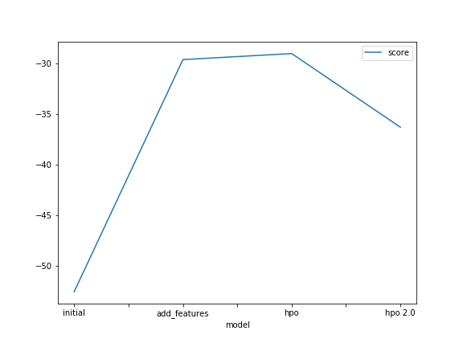
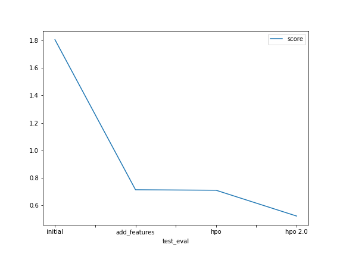

# Report: Predict Bike Sharing Demand with AutoGluon Solution
Mostafa Mahmoud Mohamed El-kabeer

## Initial Training
### What did you realize when you tried to submit your predictions? What changes were needed to the output of the predictor to submit your results?
To ignore the casual and registered columns as they are not in the test data and to handel any negative value to prediction by sitting them to zero
as the prediction can't be zero by logic as it's a predection of demand.

### What was the top ranked model that performed?
The Hyper parameter optimization model 

## Exploratory data analysis and feature creation
### What did the exploratory analysis find and how did you add additional features?
Using EDA i found that: 
- the datetime column was of type string so i changed datetime to be a datetime object.
- Extracted the hour from datetime as a new feature and in the later models extracted the year month day columns to see their impact.
- Season and weather columns were of type float meanwhile both were clearly categorical data from the data distibution in the histogram
  so i changed both to be categorical data.

### How much better did your model preform after adding additional features and why do you think that is?
Much better from a score of 1.80719 to 0.71171 , because the hours column was neglected in the datetime column as the main focus was on the date but as column it has the true meaing of time of day which is a huge factor in the change of demnad. 

## Hyper parameter tuning
### How much better did your model preform after trying different hyper parameters?
At first  slightly better not by much from a score of 0.71171 to 0.70817 after the changing of the eavluation metric to r2 and only increasing the time limit ,then i tuned the GBM,NN_TORCH model parameters and the hyperparamter_tune_kwargs and it gave a better score of 51977.
### If you were given more time with this dataset, where do you think you would spend more time?
Focusing more on:
- Tuning both of the autogluon hyperparameters and the hyperparameters of the best model identified by autogluon's previous trainings.
- Feature engineering 

### Create a table with the models you ran, the hyperparameters modified, and the kaggle score.
#### First models with only hours as new feature 

|model|eval_metric|time_limit|GBM|NN_TORCH|HPT_kwargs|score|
|--|--|--|--|--|
|initial|root_mean_squared_error|600|default|default|default|1.80719|
|add_features|root_mean_squared_error|600|default|default|default|0.71171|
|hpo|r2|800|default|default|default|0.70817|
|hpo 2.0|root_mean_squared_error|600|num_leaves:lower=26,upper=66,num_boost_round:100|'num_epochs': 10,'activation':('relu', 'softrelu', 'tanh')|'num_trials': 5,'scheduler':'local'|0.51977|

### Create a line plot showing the top model score for the three (or more) training runs during the project.

### Create a line plot showing the top kaggle score for the three (or more) prediction submissions during the project.

## Summary 
Autoglueon is an incredible automl model which can guarantee you a very good score with minimal hyperparameters tuning if Exploratory data analysis and feature creation were done right and it does so with simplicity with one line of code so it can help in time critical situations were you want a model that is powerfull in a short time period,which in our case did very well as we predicted the bike sharing demand with a score of 0.70817 with minimal hyperparameter tuning.